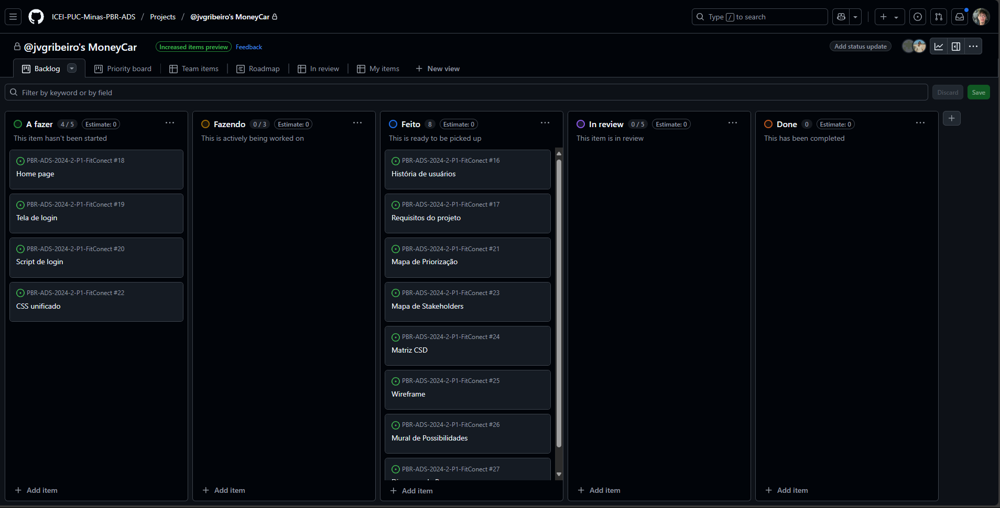

# Planejamento do Projeto

> Aqui será feito o gerenciamento das tarefas de implementação do projeto.

## Divisão de Papéis

> Apresente a divisão de papéis entre os membros do grupo em cada sprint. O desejável é que, em cada sprint, o aluno assuma papéis diferentes na disciplina. Siga o modelo do exemplo abaixo:

### Sprint 1

- _Scrum master_: Ramon José
- Protótipos: João Vitor e Kaick Diniz
- Testes: Pedro Benigno
- Documentação: Guilherme Vinicius

### Sprint 2

- _Scrum master_: AlunaY
- Desenvolvedor _front-end_: AlunoX
- Desenvolvedor _back-end_: AlunoK
- Testes: AlunaZ
-

### Sprint 3

- _Scrum master_: AlunaY
- Desenvolvedor _front-end_: AlunoX
- Desenvolvedor _back-end_: AlunoK
- Testes: AlunaZ

## Quadro de tarefas

> Apresente a divisão de tarefas entre os membros do grupo e o acompanhamento da execução, conforme exemplo abaixo.
> 
> https://github.com/orgs/ICEI-PUC-Minas-PBR-ADS/projects/13/views/1

## Sprint 1

Atualizado em: 16/04/2025

| Responsável   | Tarefa/Requisito     | Iniciado em |   Prazo    | Status | Terminado em |
| :------------ | :------------------- | :---------: | :--------: | :----: | :----------: |
| João Vitor    | Introdução           | 10/02/2025  | 01/04/2024 |   ✔️   |  30/03/2025  |
| Ramon José    | Objetivos            | 10/02/2025  | 02/02/2024 |   ✔️   |  30/03/2025  |
| Kaick Diniz   | Histórias de usuário | 10/02/2025  | 06/04/2025 |   ✔️   |  04/04/2025  |
| Pedro Benigno | Personas 1           | 10/02/2025  | 03/04/2025 |   ✔️   |  30/03/2025  |

## Sprint 2

Atualizado em: 21/04/2024

| Responsável | Tarefa/Requisito | Iniciado em |   Prazo    | Status | Terminado em |
| :---------- | :--------------- | :---------: | :--------: | :----: | :----------: |
| AlunaX      | Home-Page        | 01/02/2024  | 07/03/2024 |   ✔️   |  05/01/2005  |
| AlunaZ      | CSS Unificado    | 03/02/2024  | 10/03/2024 |   📝   |              |
| AlunoY      | Página de login  | 01/02/2024  | 07/03/2024 |   ⌛   |              |
| AlunoK      | Script de login  | 01/01/2024  | 12/03/2024 |   ❌   |              |

## Sprint 3

Atualizado em: 21/04/2024

| Responsável | Tarefa/Requisito     | Iniciado em |   Prazo    | Status | Terminado em |
| :---------- | :------------------- | :---------: | :--------: | :----: | :----------: |
| AlunaX      | Introdução           | 01/02/2024  | 07/02/2024 |   ✔️   |  05/01/2005  |
| AlunaZ      | Objetivos            | 03/02/2024  | 10/02/2024 |   📝   |              |
| AlunoY      | Histórias de usuário | 01/01/2024  | 07/01/2005 |   ⌛   |              |
| AlunoK      | Personas 1           | 01/01/2024  | 12/02/2005 |   ❌   |              |

Legenda:

- ✔️: terminado
- 📝: em execução
- ⌛: atrasado
- ❌: não iniciado

## Ferramentas

> Liste quais ferramentas foram empregadas no desenvolvimento do projeto, justificando a escolha de cada uma delas. Use o formato abaixo como exemplo.

As ferramentas empregadas no projeto são:

- Editor de código.
- Ferramentas de diagramação.
- Frameworks
- Outras ferramentas externas

## Links Úteis

> - [11 Passos Essenciais para Implantar Scrum no seu Projeto](https://mindmaster.com.br/scrum-11-passos/)
> - [Scrum em 9 minutos](https://www.youtube.com/watch?v=XfvQWnRgxG0)
